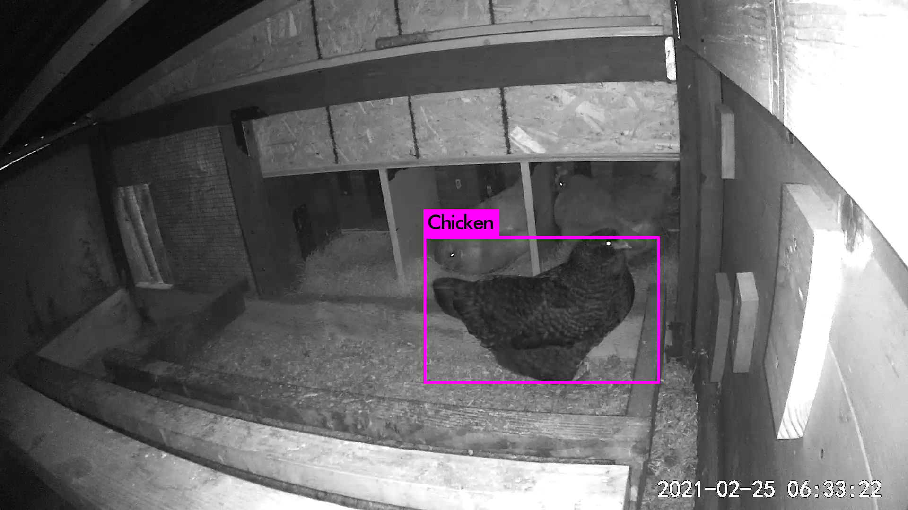
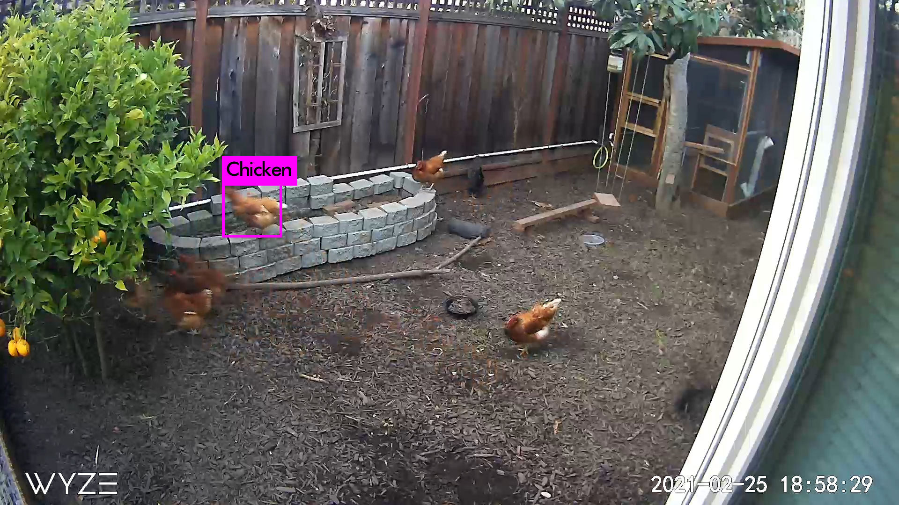

# chickenegg-detector

### A custom YOLOv3 convolutional single-shot object detection system for identifying, classifying, and counting chickens and eggs in a real farm setting. See `detector.ipynb` for core code.

Sample results:

